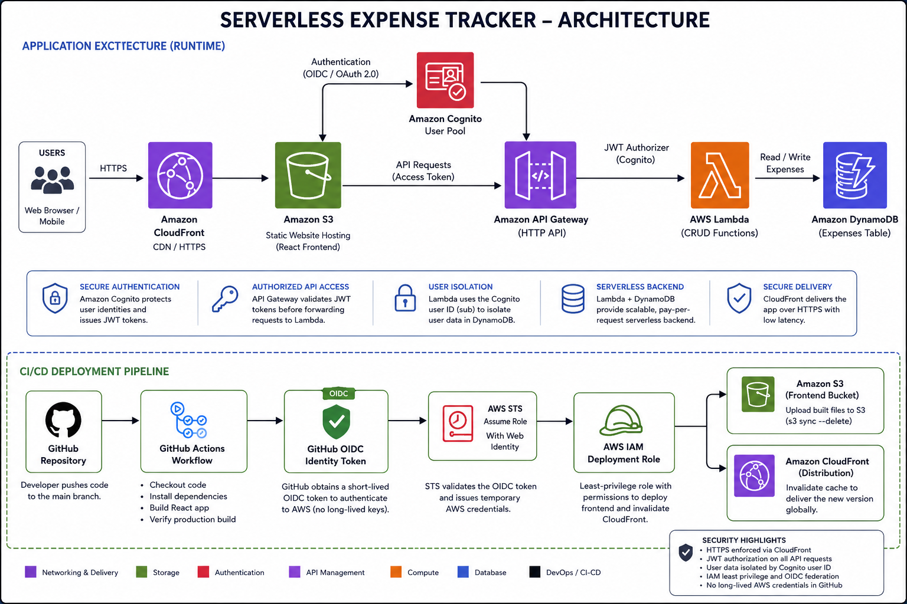

# Serverless Expense Tracker

A production-deployed full-stack serverless expense tracking application built with React and AWS.

The application allows authenticated users to create, view, update, and delete expenses while providing a dashboard with spending statistics, category breakdowns, and recent transactions.

## Live Application

Production deployment:

https://d1140sv45cs8l5.cloudfront.net/

Authentication is required to access expense data.

---

## Features

- Secure user authentication with Amazon Cognito
- Create expenses
- View expenses
- Update existing expenses
- Delete expenses
- User-specific expense isolation
- Spending dashboard
- Total spending calculation
- Transaction count
- Average expense calculation
- Spending breakdown by category
- Recent transaction history
- Responsive React frontend
- Serverless REST API
- DynamoDB persistence
- Automated CI/CD deployment with GitHub Actions
- GitHub-to-AWS authentication using OIDC
- CloudFront CDN delivery

---

## Architecture



---

## Technology Stack

### Frontend

- React
- Vite
- JavaScript
- Recharts
- react-oidc-context
- oidc-client-ts

### AWS

- Amazon Cognito
- Amazon API Gateway
- AWS Lambda
- Amazon DynamoDB
- Amazon S3
- Amazon CloudFront
- AWS IAM
- AWS STS
- OpenID Connect (OIDC)

### DevOps

- Git
- GitHub
- GitHub Actions
- AWS CLI
- GitHub Actions OIDC federation

---

## Authentication Flow

The application uses Amazon Cognito and the OAuth 2.0 / OpenID Connect authorization-code flow.

```text
User
  │
  ▼
React Application
  │
  │ Sign In
  ▼
Amazon Cognito
  │
  │ Authentication
  ▼
Authorization Code
  │
  ▼
React OIDC Client
  │
  │ Access Token
  ▼
API Gateway
  │
  │ JWT Authorization
  ▼
Lambda
```

The frontend sends the authenticated user's access token with API requests:

```http
Authorization: Bearer <access-token>
```

API Gateway validates the JWT before allowing protected requests to reach the Lambda functions.

Lambda retrieves the authenticated user's Cognito `sub` claim and uses it to scope DynamoDB operations to that user.

---

## Expense Data Model

Expenses are stored in DynamoDB using a user-partitioned key structure.

Example:

```text
PK: USER#<cognito-user-id>
SK: EXPENSE#<expense-id>
```

Example expense:

```json
{
  "PK": "USER#example-user-id",
  "SK": "EXPENSE#example-expense-id",
  "expenseId": "example-expense-id",
  "amount": 32.5,
  "category": "Food",
  "description": "Dinner",
  "expenseDate": "2026-08-22",
  "createdAt": "2026-08-22T18:54:19.605Z",
  "updatedAt": "2026-08-22T18:54:19.605Z"
}
```

This design keeps each user's expenses grouped under their authenticated user ID.

---

## API Operations

The application supports the complete CRUD lifecycle.

| Method | Endpoint | Operation |
|---|---|---|
| `POST` | `/expenses` | Create an expense |
| `GET` | `/expenses` | Retrieve the authenticated user's expenses |
| `PUT` | `/expenses/{expenseId}` | Update an expense |
| `DELETE` | `/expenses/{expenseId}` | Delete an expense |

All expense endpoints require authentication.

---

## Frontend Dashboard

The authenticated dashboard provides:

- Total spending
- Number of transactions
- Average expense
- Category spending chart
- Recent transaction history
- Add expense functionality
- Edit expense functionality
- Delete expense functionality

Dashboard values are recalculated from the authenticated user's expense data.

---

## CI/CD Pipeline

Frontend deployments are automated with GitHub Actions.

```text
Developer
    │
    │ git push
    ▼
GitHub
    │
    ▼
GitHub Actions
    │
    ├── Install dependencies
    │
    ├── Build React/Vite application
    │
    ├── Verify production build
    │
    ├── Request GitHub OIDC token
    │
    ▼
AWS STS
    │
    │ AssumeRoleWithWebIdentity
    ▼
AWS IAM Deployment Role
    │
    ├── Sync dist/ to S3
    │
    └── Create CloudFront invalidation
    ▼
Production
```

A push to `main` containing frontend or deployment-workflow changes automatically triggers the production deployment.

---

## GitHub Actions and AWS OIDC

The deployment pipeline does **not** store permanent AWS access keys in GitHub.

GitHub Actions authenticates to AWS using OpenID Connect.

AWS STS exchanges the GitHub OIDC identity for temporary credentials associated with a dedicated IAM deployment role.

The deployment role is limited to the permissions required for:

- S3 deployment
- CloudFront cache invalidation

This eliminates the need to maintain long-lived AWS credentials in GitHub Actions.

---

## Production Build Protection

The GitHub Actions workflow performs a production-build verification before deployment.

For example, deployment fails if a localhost redirect is accidentally included in the production bundle.

```bash
if grep -R "localhost:5173" dist; then
  echo "ERROR: Production build contains localhost:5173"
  exit 1
fi
```

This prevents a development authentication callback from accidentally being deployed to production.

---

## Local Development

### Prerequisites

Install:

- Node.js
- npm
- Git

Clone the repository:

```bash
git clone https://github.com/Blane47/serverless-expense-tracker.git
cd serverless-expense-tracker/frontend
```

Install dependencies:

```bash
npm install
```

Create your local environment file:

```bash
cp .env.example .env.local
```

Configure the required Vite environment variables:

```env
VITE_API_BASE_URL=<your-api-gateway-url>
VITE_COGNITO_AUTHORITY=<your-cognito-authority>
VITE_COGNITO_CLIENT_ID=<your-cognito-client-id>
```

Start the development server:

```bash
npm run dev
```

Vite will display the local development URL in the terminal.

---

## Production Build

Create a production build with:

```bash
npm run build
```

The compiled application is generated in:

```text
frontend/dist/
```

The `dist` directory is excluded from Git and generated automatically during CI/CD.

---

## Environment Configuration

Local environment files and production build artifacts are intentionally excluded from source control.

Examples include:

```text
.env
.env.local
node_modules/
dist/
```

An `.env.example` file documents the required frontend configuration without storing local environment files in the repository.

---

## Security

The application implements several security controls:

- Cognito-based user authentication
- JWT authorization at API Gateway
- User-specific DynamoDB partitioning
- IAM least-privilege deployment permissions
- GitHub Actions OIDC federation
- Temporary AWS deployment credentials
- No permanent AWS access keys required by CI/CD
- Environment files excluded from Git
- CloudFront HTTPS delivery
- Protected backend API routes

---

## Repository Structure

```text
serverless-expense-tracker/
│
├── .github/
│   └── workflows/
│       └── deploy.yml
│
├── docs/
│
├── frontend/
│   ├── public/
│   ├── src/
│   ├── .env.example
│   ├── package.json
│   ├── package-lock.json
│   ├── vite.config.js
│   └── index.html
│
├── .gitignore
├── LICENSE
└── README.md
```

---

## Deployment

Production frontend deployments are performed automatically.

After changes are committed:

```bash
git add .
git commit -m "Describe your change"
git pull --rebase origin main
git push origin main
```

GitHub Actions then:

1. Checks out the repository
2. Installs Node dependencies
3. Builds the Vite application
4. Validates the production build
5. Authenticates to AWS using OIDC
6. Uploads the production build to S3
7. Invalidates the CloudFront cache
8. Makes the new version available through CloudFront

---

## Project Goals

This project demonstrates practical implementation of:

- Serverless application architecture
- REST API design
- AWS identity and access management
- OAuth 2.0 / OpenID Connect authentication
- JWT-secured APIs
- NoSQL data modeling
- React frontend development
- Infrastructure integration
- CI/CD automation
- Cloud deployment
- Least-privilege IAM design
- OIDC-based workload identity federation

---

## Future Improvements

Potential enhancements include:

- Infrastructure as Code with AWS CDK, SAM, or Terraform
- Automated backend deployment
- Automated tests
- CloudWatch dashboards and alarms
- Custom domain with Route 53
- AWS WAF protection
- Monthly budgets and spending limits
- Expense filtering and search
- CSV export
- Recurring expenses
- Additional analytics and reporting

---

## License

This project is licensed under the terms included in the repository's `LICENSE` file.